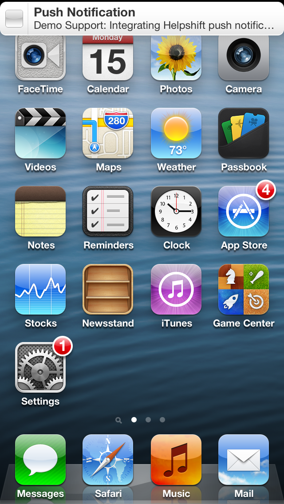

# APNApp

Demonstrates handling customer support notifications via Apple Push Notification Service

1. Open **APNApp.xcodeproj** in Xcode

1. In project explorer, navigate to **Push Notification** and open `HSDAppDelegate.m`

1. In `application:didFinishLaunchingWithOptions:` method, initialize Helpshift with your unique `API_KEY`, `DOMAIN` and `APP_ID`:

    To get the `API Key`, `Domain Name` and the `App ID`, navigate to `Settings`>`SDK (for Developers)` in your agent dashboard and scroll down to **"Initializing Helpshift"** section.

    Select your App from the dropdown and copy the three tokens to be passed when initializing Helpshift.

    

    **[Related documentation](http://developers.helpshift.com/ios/getting-started/#initializing)**

1. To setup Bundle Identifier & Code Signing:

    1. In Project Navigator, click on **Push Notification** Project, you should see project settings in the editor area.

    2. Navigate to **Build Settings** tab and select valid APN-Enabled certificate in **Code Signing**

    

    

    **[Related documentation](https://developers.helpshift.com/ios/notifications/#push-via-helpshift)**
