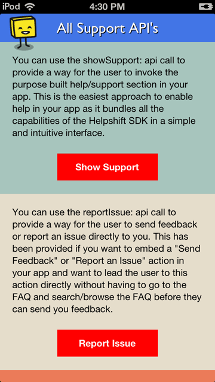

# HelpshiftSupportApp

Demonstrates all customer support APIs.

1. Open **HelpshiftSupportApp.xcodeproj** in Xcode

1. In project explorer, navigate to **Full Support** and open `HSDAppDelegate.m`

1. In `application:didFinishLaunchingWithOptions:` method, initialize Helpshift with your unique `API_KEY`, `DOMAIN` and `APP_ID`:

    To get the `API Key`, `Domain Name` and the `App ID`, navigate to `Settings`>`SDK (for Developers)` in your agent dashboard and scroll down to **"Initializing Helpshift"** section.

    Select your App from the dropdown and copy the three tokens to be passed when initializing Helpshift.

    

    **[Related documentation](http://developers.helpshift.com/ios/getting-started/#initializing)**

1. See **btnSupportClick:** method in `HSDViewController.m` to show support screen & decomposed support screen.

    **[Related documentation](http://developers.helpshift.com/ios/support-tools/#full-support)**

