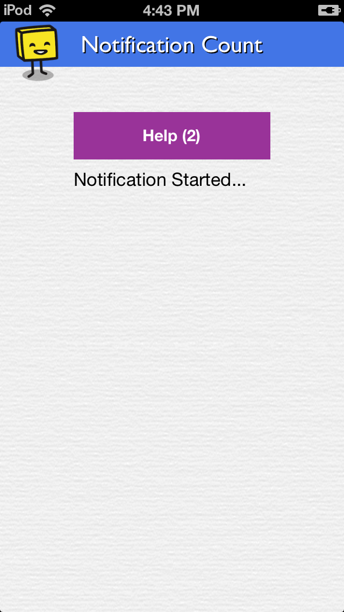

# NotificationCountApp

Demonstrates updating notification count when support agents reply to your app users.

1. Open **NotificationCountApp.xcodeproj** in Xcode

1. In project explorer, navigate to **Notification Count** and open `HSDAppDelegate.m`

1. In `application:didFinishLaunchingWithOptions:` method, initialize Helpshift with your unique `API_KEY`, `DOMAIN` and `APP_ID`:

    To get the `API Key`, `Domain Name` and the `App ID`, navigate to `Settings`>`SDK (for Developers)` in your agent dashboard and scroll down to **"Initializing Helpshift"** section.

    Select your App from the dropdown and copy the three tokens to be passed when initializing Helpshift.

    

    **[Related documentation](http://developers.helpshift.com/ios/getting-started/#initializing)**

1. See `notificationCountAsyncReceived:` delegate method in `HSDViewController.m`. This example gets notification count asynchronously.

    **[Related documentation](http://developers.helpshift.com/ios/notifications/#notification-badges)**

    
