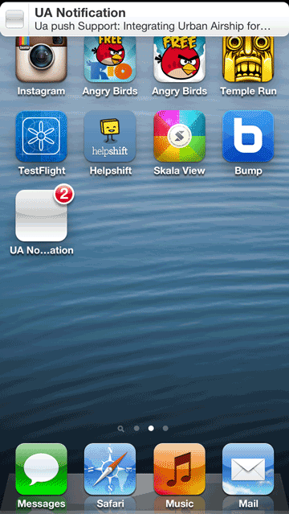

# UrbanAirshipApp

Demonstrates integrating Urban Airship for Helpshift notifications in your app

1. Get an Urban Airship account. Get yours [here](https://go.urbanairship.com/accounts/register/).

1. Follow the steps described [here](https://docs.urbanairship.com/display/DOCS/Getting+Started%3A+iOS%3A+Push) to setup your application with Apple and enable push notifications.

1. Open **UrbanAirshipApp.xcodeproj** in Xcode

1. In project explorer, navigate to **UA Notification** and open `HSAppDelegate.m`

1. In `application:didFinishLaunchingWithOptions:` method, initialize Helpshift with your unique `API_KEY`, `DOMAIN` and `APP_ID`:

    To get the `API Key`, `Domain Name` and the `App ID`, navigate to `Settings`>`SDK (for Developers)` in your agent dashboard and scroll down to **"Initializing Helpshift"** section.

    Select your App from the dropdown and copy the three tokens to be passed when initializing Helpshift.

    

    **[Related documentation](http://developers.helpshift.com/ios/getting-started/#initializing)**

1. To setup Bundle Identifier & Code Signing:

    1. In Project Navigator, click on **UA Notification** Project, you should see project settings in the editor area.

    2. Navigate to **Build Settings** tab and select valid APN-Enabled certificate in **Code Signing**

1. See methods `application:didRegisterForRemoteNotificationsWithDeviceToken:` and `application:didReceiveRemoteNotification:` in `HSDAppDelegate.m` for handling Helpshift notifications via Urban Airship.

    **[Related documentation](http://developers.helpshift.com/ios/notifications/#configure-urban-airship)**

    

    
